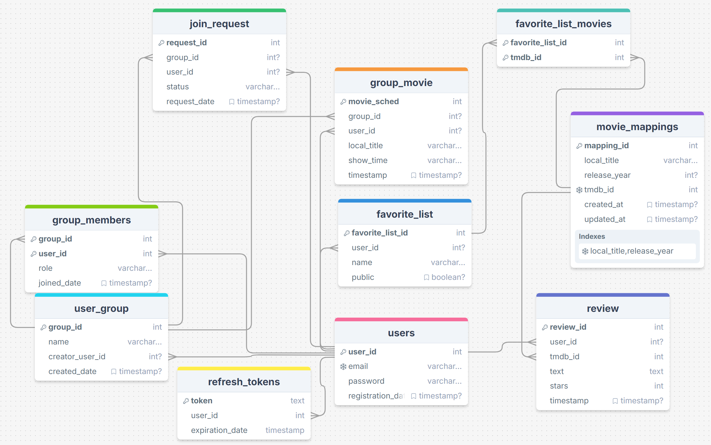

# MovieApp
Made by **Aleksi Jokinen** and **Lasse Töyräs**

This repository contains the **MovieApp**, which is divided into two main folders:

1. **movieapp**: Frontend of the application (React-based).
2. **movieapp-server**: Backend of the application (Node.js with Express).

---
## Resources

- **Database Diagram**: 
- **UI Design**: [Moqups](https://app.moqups.com/O3n32wjqkYpdSJPYaJmG19BZjCfP7MHH/view/page/ad64222d5)
- **Work Hours**: [Work Hours Documentation](https://unioulu-my.sharepoint.com/:x:/g/personal/t3joal00_students_oamk_fi/Ea04_oaZPPpHoPMoM6HTn4kBliY2F3vXSMCTcVKl_vgSGw?e=BX3RDS)
---

## Setup and Run

### Prerequisites
- Node.js installed on your machine
- PostgreSQL database

### Installation and Running

1. **Clone the repository**:
   ```bash
   git clone https://github.com/your-repo/movieapp.git
   cd movieapp
   ```

2. **Setup the Client**:
   ```bash
   cd movieapp-client
   npm install
   npm start
   ```

3. **Setup the Server**:
   ```bash
   cd movieapp-server
   npm install
   npm start
   ```

---

## Setting Up the Database

1. Create a PostgreSQL database.
2. Run the following SQL query to set up the database schema:
   ```sql
   CREATE TABLE users (
    user_id SERIAL PRIMARY KEY,
    email VARCHAR(255) UNIQUE NOT NULL,
    password VARCHAR(255) NOT NULL,
    registration_date TIMESTAMP DEFAULT CURRENT_TIMESTAMP
    );

    CREATE TABLE movie_mappings (
    mapping_id SERIAL PRIMARY KEY,
    local_title VARCHAR(255) NOT NULL,
    release_year INTEGER,
    tmdb_id INTEGER NOT NULL UNIQUE,
    created_at TIMESTAMP DEFAULT CURRENT_TIMESTAMP,
    updated_at TIMESTAMP DEFAULT CURRENT_TIMESTAMP,
    UNIQUE (local_title, release_year)
    );

    CREATE TABLE review (
    review_id SERIAL PRIMARY KEY,
    user_id INTEGER REFERENCES users(user_id) ON DELETE CASCADE,
    tmdb_id INTEGER NOT NULL,
    text TEXT NOT NULL,
    stars INTEGER CHECK (stars BETWEEN 1 AND 5) NOT NULL,
    timestamp TIMESTAMP DEFAULT CURRENT_TIMESTAMP,
    FOREIGN KEY (tmdb_id) REFERENCES movie_mappings(tmdb_id) ON DELETE CASCADE
    );

    CREATE TABLE favorite_list (
    favorite_list_id SERIAL PRIMARY KEY,
    user_id INTEGER REFERENCES users(user_id) ON DELETE CASCADE,
    name VARCHAR(255) NOT NULL,
    public BOOLEAN DEFAULT FALSE
    );

    CREATE TABLE favorite_list_movies (
    favorite_list_id INTEGER REFERENCES favorite_list(favorite_list_id) ON DELETE CASCADE,
    tmdb_id INTEGER REFERENCES movie_mappings(tmdb_id) ON DELETE CASCADE,
    PRIMARY KEY (favorite_list_id, tmdb_id)
    );

    CREATE TABLE user_group (
    group_id SERIAL PRIMARY KEY,
    name VARCHAR(255) NOT NULL,
    creator_user_id INTEGER REFERENCES users(user_id) ON DELETE CASCADE,
    created_date TIMESTAMP DEFAULT CURRENT_TIMESTAMP
    );

    CREATE TABLE group_members (
    group_id INTEGER REFERENCES user_group(group_id) ON DELETE CASCADE,
    user_id INTEGER REFERENCES users(user_id) ON DELETE CASCADE,
    role VARCHAR(10) CHECK (role IN ('owner', 'member')) NOT NULL,
    joined_date TIMESTAMP DEFAULT CURRENT_TIMESTAMP,
    PRIMARY KEY (group_id, user_id)
    );

    CREATE TABLE join_request (
    request_id SERIAL PRIMARY KEY,
    group_id INTEGER REFERENCES user_group(group_id) ON DELETE CASCADE,
    user_id INTEGER REFERENCES users(user_id) ON DELETE CASCADE,
    status VARCHAR(10) CHECK (status IN ('pending', 'accepted', 'rejected')) NOT NULL,
    request_date TIMESTAMP DEFAULT CURRENT_TIMESTAMP
    );

    CREATE TABLE refresh_tokens (
    token TEXT PRIMARY KEY,
    user_id INTEGER NOT NULL,
    expiration_date TIMESTAMP NOT NULL,
    FOREIGN KEY (user_id) REFERENCES users(user_id) ON DELETE CASCADE
    );
    CREATE TABLE group_movie (
    movie_sched SERIAL PRIMARY KEY,
    group_id INTEGER REFERENCES user_group(group_id) ON DELETE CASCADE,
    user_id INTEGER REFERENCES users(user_id) ON DELETE CASCADE,
    local_title VARCHAR(255) NOT NULL,
    show_time VARCHAR(255) NOT NULL,
    timestamp TIMESTAMP DEFAULT CURRENT_TIMESTAMP,
    FOREIGN KEY (user_id) REFERENCES users(user_id) ON DELETE CASCADE
    );  
   ```

3. Update the `.env` files in the **movieapp-server** folder with your database credentials and tokens:
   ```plaintext
   PORT=your_port
   DB_USER=your_db_username
   DB_PASSWORD=your_db_password
   DB_NAME=your_db_name
   DB_HOST=localhost
   DB_PORT=5432
   TEST_DB_USER=postgres
   TEST_DB_HOST=localhost
   TEST_DB_NAME=movieapp_test
   TEST_DB_PASSWORD=pass
   TEST_DB_PORT=5432
   TMDB_TOKEN='your_tmdb_token'
   JWT_SECRET='your_secret'
   JWT_REFRESH_SECRET='your_refresh_secret'
   ```

---

### Testing (Server)
To run the tests for the backend:
```bash
npm test
```


